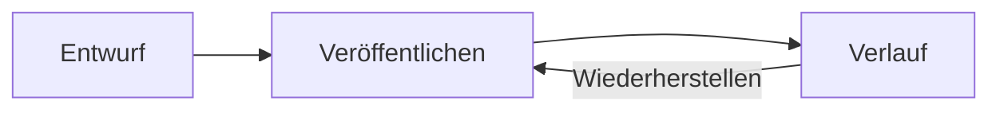

# Alle Blöcke einer Seite

Diese Seite zeigt jeden Block und jede Formatierung, die der Editor anbietet, jeweils mit einem Hinweis, wie sie auf eine Seite kommt. Öffnen Sie sie mit **Bearbeiten** im Editor, um zu sehen, wie jeder Block gemacht ist; was Sie dort ändern, erreicht niemanden, bis Sie veröffentlichen.

> [!NOTE]
> Drei Wege führen hinein: Tippen Sie **/** am Anfang eines Wortes, um das Menü **Block einfügen** zu öffnen, und wählen Sie beim Weitertippen aus; nutzen Sie die Werkzeugleiste über dem Text; oder ein Tastenkürzel. Mod steht für Strg, auf einem Mac für Cmd.

%%properties%%

| Zielgruppe | Alle |
|---|---|
| Lesezeit | 10 Minuten |

%%end%%

<div data-stator="toc" data-max-level="2"></div>

## Text und Formatierung

Ein Absatz ist schlichter Text: **Text** im Menü, oder Mod+Alt+0. Darin schreiben Sie **fett** (Mod+B), *kursiv* (Mod+I), ~~durchgestrichen~~ (Mod+Shift+S) und `Code im Text` (Mod+E), alles auch in der Werkzeugleiste. Wer \*\*fett\*\*, \*kursiv\*, \~\~durchgestrichen\~\~ oder ein Wort in Backticks tippt, erreicht dasselbe beim Schreiben.

Einen [Link](https://github.com/Cloudster1/Armature) setzt die Schaltfläche **Link** der Werkzeugleiste auf markiertem Text, oder Sie tippen oder fügen eine Adresse ein, die von selbst zum Link wird.\
Shift+Enter bricht die Zeile um, ohne einen neuen Absatz zu beginnen, wie vor diesem Satz.

Emoji stehen überall im Text 🎉: Tippen Sie einen Doppelpunkt und den englischen Namen des Emoji, etwa :tada, oder wählen Sie **Emoji** im Menü.

## Überschriften

Überschriften gibt es in drei Stufen: **Überschrift 1** bis **Überschrift 3** im Menü, **Textstil** in der Werkzeugleiste, Mod+Alt+1 bis 3, oder #, ## oder ### und ein Leerzeichen am Zeilenanfang. Der Seitentitel steht über allen. Das Inhaltsverzeichnis oben auf dieser Seite listet die Überschriften und folgt ihnen, wenn sie sich ändern: **Inhaltsverzeichnis** im Menü.

### Eine Überschrift der dritten Stufe

Die kleinste Überschrift, für einen Teil eines Abschnitts.

## Listen

Eine **Aufzählung** beginnt mit einem Bindestrich und einem Leerzeichen, oder Mod+Shift+8:

- Ein Eintrag
- Noch ein Eintrag, mit einem darunter
  - Tab rückt einen Eintrag ein, Shift+Tab rückt ihn wieder aus

Eine **Nummerierte Liste** beginnt mit 1. und einem Leerzeichen, oder Mod+Shift+7. Sie darf bei jeder Zahl anfangen:

3. Drittens
4. Viertens

Eine **Checkliste** beginnt mit [ ] und einem Leerzeichen, oder Mod+Shift+9. Ein Eintrag, dessen erste Erwähnung eine Person ist, ist ihre Aufgabe, fällig am ersten Datum darin, und steht unter **Meine Aufgaben**:

- [ ] Diese Seite lesen <span data-stator="mention" data-id="{{.Me.ID}}">@{{html .Me.Name}}</span> bis <span data-stator="date">{{.Soon}}</span>
- [ ] Den Editor auf einer eigenen Seite ausprobieren <span data-stator="mention" data-id="{{.Me.ID}}">@{{html .Me.Name}}</span> bis <span data-stator="date">{{.NextWeek}}</span>
- [x] Den Beispielbereich anlegen

## Zitate und Trennlinien

> Ein **Zitat** hebt Worte von anderswo ab: im Menü, in der Werkzeugleiste, mit Mod+Shift+B oder mit > und einem Leerzeichen.

Eine **Trennlinie** ist eine Linie zwischen zwei Teilen einer Seite: im Menü, in der Werkzeugleiste oder mit drei Bindestrichen.

---

## Code

Ein **Codeblock** behält seine Abstände und wird für seine Sprache hervorgehoben, die Sie in der Leiste wählen, die darin erscheint. Tippen Sie drei Backticks und die Sprache, nutzen Sie Mod+Alt+C oder das Menü:

```go
func greet(name string) string {
	return "Hallo, " + name
}
```

## Tabellen und Diagramme

Eine **Tabelle** beginnt mit drei Zeilen, drei Spalten und einer Kopfzeile: im Menü oder in der Werkzeugleiste. Darin fügt eine eigene Leiste Zeilen und Spalten ein und löscht sie, verbindet und teilt Zellen, färbt sie und macht die erste Zeile oder Spalte zum Kopf. Tab springt zur nächsten Zelle.

| Team | Seiten | Kommentare |
|---|--:|--:|
| Design | 12 | 30 |
| Support | 18 | 41 |

Ein **Diagramm aus Tabelle** zeichnet eine Tabelle als Balken, Linien oder Kreis und folgt ihr, wenn Sie die Zahlen ändern: im Menü, oder mit der Diagramm-Schaltfläche in der Leiste einer Tabelle.

%%chart bar%%

| Monat | Seiten | Kommentare |
|---|--:|--:|
| Juli | 12 | 30 |
| August | 18 | 41 |
| September | 25 | 57 |

%%end%%

## Hinweisfelder

Hinweisfelder heben etwas in einer Farbe des Designs ab: die fünf Hinweisfelder im Menü, oder **Hinweisfeld** in der Werkzeugleiste, dessen Leiste dann die Art ändert.

> [!NOTE]
> Ein **Info-Hinweisfeld**, für nützlichen Kontext.

> [!IMPORTANT]
> Ein **Notiz-Hinweisfeld**, für eine Randbemerkung.

> [!TIP]
> Ein **Erfolgs-Hinweisfeld**, für ein Ergebnis oder einen Tipp.

> [!WARNING]
> Ein **Warn-Hinweisfeld**, für etwas, bei dem Vorsicht geboten ist.

> [!CAUTION]
> Ein **Fehler-Hinweisfeld**, für etwas, das nicht passieren darf.

## Aufklappbereich

<details><summary>Ein Aufklappbereich: öffnen Sie ihn für die Einzelheiten</summary>

Lesende öffnen und schließen ihn, wie sie wollen; die Seite speichert nur seinen Titel. **Aufklappbereich** im Menü.

</details>

## Spalten

%%columns%%

%%column%%

**Zwei Spalten** oder **Drei Spalten** im Menü stellen Blöcke nebeneinander. Eine Leiste darin ändert die Aufteilung oder nimmt die Spalten weg und behält ihren Inhalt.

%%end%%

%%column%%

Auf einem schmalen Bildschirm stehen die Spalten untereinander, damit sich eine Seite auch auf dem Telefon gut liest.

%%end%%

%%end%%

%%columns%%

%%column%%

Eins

%%end%%

%%column%%

Zwei

%%end%%

%%column%%

Drei

%%end%%

%%end%%

## Formeln

Eine Formel im Text, etwa `$E = mc^2$`, ist eine **Formel im Text**; eine in eigener Zeile ist ein **Formelblock**. Beide schreiben Sie in LaTeX in einem Dialog, der das Ergebnis beim Tippen zeigt:

```math
\int_0^1 x^2 \, dx = \frac{1}{3}
```

## Diagramme

Ein **Diagramm** schreiben Sie als Mermaid-Text, und es wird beim Tippen gezeichnet: Abläufe, Sequenzen und mehr, aus dem Menü.



## Entscheidungen

Eine **Entscheidung** ist eine Zeile, die sagt, was entschieden ist oder was noch offen ist. **Entscheidungen** in der Seitenleiste des Bereichs listet jede aus seinen veröffentlichten Seiten.

%%decided%% Wir schreiben unsere Anleitungen in diesem Bereich.

%%undecided%% Mit welcher Bereichsvorlage das nächste Team beginnt.

## Status, Daten und Erwähnungen

Ein **Status** ist ein farbiges Etikett in der Textzeile, etwa <span data-stator="status" data-color="success">ERLEDIGT</span>, <span data-stator="status" data-color="warning">IN PRÜFUNG</span> oder <span data-stator="status" data-color="neutral">IDEE</span>. Ein **Datum** ist ein Tag, etwa <span data-stator="date">{{.Today}}</span>, im Format aller Lesenden. Beide kommen aus dem Menü; Enter auf einem öffnet seinen Dialog.

Eine Erwähnung nennt eine Person und benachrichtigt sie: Tippen Sie @ und wählen Sie aus den vorgeschlagenen Personen, wie hier: <span data-stator="mention" data-id="{{.Me.ID}}">@{{html .Me.Name}}</span>.

## Links und Einbettungen

Eine **Linkvorschau** zeigt eine Adresse als Karte mit Titel und Zusammenfassung ihrer Seite, oder als Player einer Video- oder Design-Seite, die es erlaubt, also eingebettet. Jede Ansicht fragt sie neu an, deshalb veraltet sie nie:

%%link-card card https://github.com/Cloudster1/Armature%%

## Bilder und Dateien

{{if .Files}}Ein Bild ist eine Datei der Seite, im Text gezeigt: **Dateien anhängen** in der Werkzeugleiste, oder fügen Sie es in den Editor ein oder ziehen Sie es hinein. Ist es ausgewählt, setzt eine Leiste seine Beschreibung und seine Breite.


Jede andere Datei wird ein Chip im Text, etwa [team-numbers.csv](showcase.files/team-numbers.csv). Der Block **Dateien** listet die Dateien der Seite mit ihren Versionen und nimmt weitere an: Laden Sie eine Datei unter einem Namen hoch, den die Seite schon hat, wird sie dessen nächste Version, wie bei dieser.

%%files%%
{{else}}Diese Website speichert keine Dateien, deshalb zeigt diese Seite kein Bild, keine Datei und keine Dateiliste. Sobald die Administratoren der Website einen Dateispeicher einrichten, setzt **Dateien anhängen** in der Werkzeugleiste Bilder in den Text und andere Dateien als Chips, und **Dateien** im Menü listet sie mit ihren Versionen.
{{end}}
## Auszüge und Einbindungen

%%excerpt Gruß der Blockübersicht%%

Ein **Auszug** benennt einige Blöcke einer Seite, wie diesen Absatz, damit andere Seiten sie zeigen können. Setzen Sie den Cursor in die Blöcke und wählen Sie ihn im Menü.

%%end%%

**Einbinden** zeigt eine andere Seite oder einen ihrer Auszüge, aktuell, wenn sich die Seite ändert, und nur denen, die sie lesen dürfen. Hier ist der Auszug von [Bereiche und Seiten](spaces-and-pages.md):

%%include spaces-and-pages%%

## Seiteneigenschaften und Berichte

**Eigenschaften** sind die Metadaten einer Seite als Tabelle aus Namen und Werten, wie oben auf dieser Seite. Ein **Eigenschaftenbericht** sammelt sie von allen Seiten mit bestimmten Schlagwörtern in einer Tabelle:

%%properties-report anleitung: Zielgruppe, Lesezeit%%

## Listen von Seiten

**Unterseiten** listet die Seiten unter einer Seite:

<div data-stator="child-pages" data-scope="children" data-sort="tree"></div>

**Inhalte nach Schlagwort** listet die Seiten mit bestimmten Schlagwörtern, hier die Anleitungen zum Zugriff:

%%labelled-pages zugriff%%

**Zuletzt aktualisiert** listet die zuletzt veröffentlichten Seiten eines Bereichs oder aller:

%%recently-updated%%

**Neueste Blogbeiträge** listet die neuesten Beiträge aus dem Blog eines Bereichs oder aller Bereiche:

%%blog-posts%%

## Aufgaben

Ein **Aufgabenbericht** listet die Aufgaben, die ein Filter wählt, nach Bereich, zugewiesener Person, Fälligkeit und Status. Dieser zeigt Ihre offenen Aufgaben in diesem Bereich, darunter die aus der Checkliste oben, sobald Sie sie lesen:

%%task-report%%

## Kalender

Ein **Kalender** zeigt einen Monat eines Kalenders des Bereichs: seine Termine und Abwesenheiten{{if .Armature}}, und die Vorgänge eines Armature-Projekts, die in dem Monat fällig sind{{end}}. Wer Seiten hinzufügen darf, pflegt die Termine direkt im Block.

%%calendar%%

## Vorlagen-Schaltflächen

Eine **Vorlagen-Schaltfläche** legt mit einem Klick eine neue Seite aus einer Vorlage an, wo Sie es gewählt haben. Diese legt Besprechungsnotizen in den Ordner unter [Der Seitenbaum und Ordner](page-tree.md):

%%template-button meeting-notes: Neue Besprechungsnotizen: Besprechungsnotizen {date}%%

## Mitwirkende

**Mitwirkende** nennt die Personen, die diese Seite veröffentlicht haben, oder sie und die Seiten darunter:

%%contributors page%%

## Armature

{{if .Armature}}Ist Armature verbunden, wird ein getippter Vorgangsschlüssel wie {{.Armature.Issue}} mit einem Leerzeichen zum Chip, der den Vorgang so zeigt, wie alle Lesenden ihn sehen dürfen{{if .Armature.Issue}}: <span data-stator="issue">{{.Armature.Issue}}</span>{{end}}. Die Adresse eines Vorgangs einzufügen tut dasselbe. Das Menü bietet vier weitere Blöcke.

{{if .Armature.Issue}}Ein **Armature-Vorgang** ist eine Karte eines Vorgangs:

<div data-stator="issue">{{.Armature.Issue}}</div>

{{end}}Eine **Armature-Vorgangsliste** ist eine Tabelle der Vorgänge, die eine Abfrage findet:

<div data-stator="issues" data-columns="key,summary,status,assignee" data-limit="10">project = {{.Armature.Project}}</div>

Ein **Armature-Diagramm** teilt die Vorgänge einer Abfrage nach einem Feld auf, oder zählt erstellte gegen erledigte:

%%armature-chart%%

Eine **Armature-Roadmap** legt die Vorgänge einer Abfrage auf eine Zeitleiste, nach Epic oder Team:

%%armature-roadmap%%
{{else}}Diese Organisation hat kein verbundenes Armature, das der Person, die diesen Bereich angelegt hat, ein Projekt gezeigt hat, deshalb stehen hier keine Armature-Blöcke. Sobald eine Administratorin oder ein Administrator Armature unter **Armature** im Kontomenü verbindet und Sie Ihr eigenes Token in Ihrem Profil hinterlegen, wird ein getippter Vorgangsschlüssel zum Chip, und das Menü bietet **Armature-Vorgang**, **Armature-Vorgangsliste**, **Armature-Diagramm** und **Armature-Roadmap**. Siehe [Armature](armature.md).
{{end}}