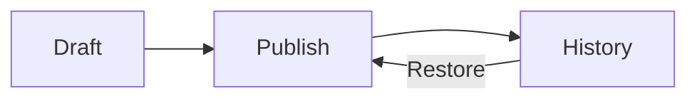

# Every block a page can hold

This page shows every block and every kind of formatting the editor offers, each with a note on how to put it on a page. Open it in the editor with **Edit** to see how each one is made; nothing you change there reaches anybody until you publish.

> [!NOTE]
> Three ways in: type **/** at the start of a word to open the slash menu, **Insert a block**, and pick from it as you type; use the toolbar above the text; or use a keyboard shortcut. Mod means Ctrl, or Cmd on a Mac.

{{if .Files}}The picture across the top of this page is its **cover**. Whoever may edit a page sets one under **Appearance** in the page's menu: upload a picture or pick one of the page's own, then click the point that should stay in view however wide the window is. The same dialog puts an emoji before a page's title and chooses its width.{{else}}A page can carry a **cover**, a picture across its top, set under **Appearance** in the page's menu; this site keeps no files, so this page has none.{{end}}

%%properties%%

| Audience | Everybody |
|---|---|
| Reading time | 10 minutes |

%%end%%

<div data-stator="toc" data-max-level="2"></div>

## Text and formatting

A paragraph is plain text: the slash menu's **Text**, or Mod+Alt+0. Within it you can write **bold** (Mod+B), *italic* (Mod+I), ~~struck through~~ (Mod+Shift+S) and `inline code` (Mod+E), each also on the toolbar. Typing \*\*bold\*\*, \*italic\*, \~\~strike\~\~ or a word in backticks does the same as you type.

A [link](https://github.com/Cloudster1/Armature) is made with the toolbar's **Link** button on selected text, or by typing or pasting an address, which becomes a link by itself.\
Shift+Enter breaks the line without starting a new paragraph, as it did before this sentence.

Emoji go anywhere in the text 🎉: type a colon and the emoji's English name, such as :tada, or pick **Emoji** in the slash menu.

## Headings

Headings come in three levels: the slash menu's **Heading 1** to **Heading 3**, the toolbar's **Text style**, Mod+Alt+1 to 3, or typing #, ## or ### and a space at the start of a line. The page title sits above them all. The table of contents at the top of this page lists the headings and follows them as they change: the slash menu's **Table of contents**.

### A heading of the third level

The smallest heading, for a part of a section.

## Lists

A **Bulleted list** starts with a dash and a space, or Mod+Shift+8:

- An item
- Another item, with one below it
  - Tab indents an item, Shift+Tab takes it back out

A **Numbered list** starts with 1. and a space, or Mod+Shift+7. It may start at any number:

3. Third
4. Fourth

A **Checklist** starts with [ ] and a space, or Mod+Shift+9. An item whose first mention is a person is their task, due on the first date in it, and listed under **My tasks**:

- [ ] Read this page <span data-stator="mention" data-id="{{.Me.ID}}">@{{html .Me.Name}}</span> by <span data-stator="date">{{.Soon}}</span>
- [ ] Try the editor on a page of your own <span data-stator="mention" data-id="{{.Me.ID}}">@{{html .Me.Name}}</span> by <span data-stator="date">{{.NextWeek}}</span>
- [x] Make the example space

## Quotes and dividers

> A **Quote** sets words from somewhere else apart: the slash menu, the toolbar, Mod+Shift+B, or a > and a space.

A **Divider** is a line between two parts of a page: the slash menu, the toolbar, or three dashes.

---

## Code

A **Code block** keeps its spacing and is highlighted for its language, chosen in the toolbar row that appears inside it. Type three backticks and the language, use Mod+Alt+C, or the slash menu:

```go
func greet(name string) string {
	return "Hello, " + name
}
```

## Tables and charts

A **Table** starts with three rows and three columns and a header row: the slash menu or the toolbar. Inside it a toolbar row adds and deletes rows and columns, merges and splits cells, colours them and makes the first row or column a header. Tab moves to the next cell.

| Team | Pages | Comments |
|---|--:|--:|
| Design | 12 | 30 |
| Support | 18 | 41 |

A **Chart from table** draws a table as bars, lines or a pie and follows it as you edit the numbers: the slash menu, or **Chart this table** in a table's toolbar row.

%%chart bar%%

| Month | Pages | Comments |
|---|--:|--:|
| July | 12 | 30 |
| August | 18 | 41 |
| September | 25 | 57 |

%%end%%

## Panels

Panels set something apart in a colour of the theme: the slash menu's five panels, or the toolbar's **Panel**, whose row then changes its type.

> [!NOTE]
> An **Info panel**, for useful context.

> [!IMPORTANT]
> A **Note panel**, for an aside.

> [!TIP]
> A **Success panel**, for a result or a tip.

> [!WARNING]
> A **Warning panel**, for something to be careful about.

> [!CAUTION]
> An **Error panel**, for something that must not happen.

## Expand

<details><summary>An Expand: open it for the detail</summary>

Readers open and close it as they please; the page keeps only its title. The slash menu's **Expand**.

</details>

## Columns

%%columns%%

%%column%%

**Two columns** or **Three columns** from the slash menu set blocks side by side. A toolbar row inside them changes the layout or takes the columns away, keeping what is in them.

%%end%%

%%column%%

On a narrow screen the columns stack, one under the other, so a page reads well on a phone too.

%%end%%

%%end%%

%%columns%%

%%column%%

One

%%end%%

%%column%%

Two

%%end%%

%%column%%

Three

%%end%%

%%end%%

## Formulas

A formula in the text, such as `$E = mc^2$`, is an **Inline formula**; one on a line of its own is a **Formula block**. Both are written in LaTeX in a dialog that shows the result as you type:

```math
\int_0^1 x^2 \, dx = \frac{1}{3}
```

## Diagrams

A **Diagram** is written as Mermaid text and drawn as you type: flowcharts, sequences and more, from the slash menu.



## Sketches

A **Sketch** is drawn by hand: boxes, arrows, text and freehand lines on a canvas. Pick **Sketch** from the slash menu and draw, then choose **Done**; give it a title, which is what screen readers and search read of it. Readers see the drawing and can open it larger.

```excalidraw "From draft to published"
{
  "type": "excalidraw",
  "version": 2,
  "source": "stator",
  "elements": [
    {"id": "draft-box", "type": "rectangle", "x": 0, "y": 0, "width": 180, "height": 80, "backgroundColor": "#a5d8ff", "strokeColor": "#1e1e1e", "fillStyle": "solid", "strokeWidth": 2, "roughness": 1, "roundness": {"type": 3}},
    {"id": "draft-text", "type": "text", "x": 0, "y": 27, "width": 180, "height": 25, "text": "Draft", "originalText": "Draft", "strokeColor": "#1e1e1e", "fontSize": 20, "fontFamily": 5, "textAlign": "center", "verticalAlign": "middle"},
    {"id": "publish-arrow", "type": "arrow", "x": 190, "y": 40, "width": 110, "height": 0, "points": [[0, 0], [110, 0]], "strokeColor": "#1e1e1e", "strokeWidth": 2, "roughness": 1, "endArrowhead": "arrow"},
    {"id": "published-box", "type": "rectangle", "x": 310, "y": 0, "width": 180, "height": 80, "backgroundColor": "#b2f2bb", "strokeColor": "#1e1e1e", "fillStyle": "solid", "strokeWidth": 2, "roughness": 1, "roundness": {"type": 3}},
    {"id": "published-text", "type": "text", "x": 310, "y": 27, "width": 180, "height": 25, "text": "Published", "originalText": "Published", "strokeColor": "#1e1e1e", "fontSize": 20, "fontFamily": 5, "textAlign": "center", "verticalAlign": "middle"}
  ],
  "appState": {"viewBackgroundColor": "#ffffff"},
  "files": {}
}
```

## Decisions

A **Decision** is a line that says what was decided, or what still is open. The space's **Decisions** log in the sidebar lists every one from its published pages.

%%decided%% We write our guides in this space.

%%undecided%% Which space template the next team starts from.

## Status, dates and mentions

A **Status** is a coloured label in the line of text, such as <span data-stator="status" data-color="success">DONE</span>, <span data-stator="status" data-color="warning">IN REVIEW</span> or <span data-stator="status" data-color="neutral">IDEA</span>. A **Date** is a day, such as <span data-stator="date">{{.Today}}</span>, shown in each reader's own format. Both come from the slash menu; Enter on one opens its dialog.

A mention names a person and tells them: type @ and pick from the people suggested, as here: <span data-stator="mention" data-id="{{.Me.ID}}">@{{html .Me.Name}}</span>.

## Links and embeds

A **Link preview** shows an address as a card with its page's title and summary, or as the player of a video or design site that allows it, which is an embed. Each reader's view asks for it, so it never goes stale:

%%link-card card https://github.com/Cloudster1/Armature%%

## Pictures and files

{{if .Files}}A picture is a file of the page shown in the text: the toolbar's **Attach files**, or paste or drop it into the editor. When you select it, a toolbar row sets its description and its width.


Several pictures go side by side in a **Gallery** from the slash menu: pick them from the page's files or upload new ones, put them in order, give each a caption and choose how many fit in a row. Click one to see it larger and step through the others with the arrow keys or a swipe.

%%gallery 2%%


%%end%%

Any other file becomes a chip in the text, such as [team-numbers.csv](showcase.files/team-numbers.csv). The **Files** block lists the page's files with their versions and takes more: upload a file under a name the page has already and it becomes that file's next version, as this one did.

%%files%%
{{else}}This site keeps no files, so this page shows no picture, no gallery, no file and no list of files. Once the site's administrators set up file storage, the toolbar's **Attach files** puts pictures in the text and other files as chips, the slash menu's **Gallery** sets pictures side by side, and its **Files** lists them with their versions.
{{end}}
## Excerpts and includes

%%excerpt Showcase greeting%%

An **Excerpt** names some blocks of a page, like this paragraph, so other pages can show them. Place the caret in the blocks and pick it from the slash menu.

%%end%%

An **Include** shows another page, or one excerpt of it, kept up to date as that page changes, and only to readers who may read it. Here is the excerpt of [Spaces and pages](spaces-and-pages.md):

%%include spaces-and-pages%%

## Page properties and reports

**Properties** are a page's metadata as a table of names and values, as at the top of this page. A **Properties report** gathers them from every page with some labels into one table:

%%properties-report guide: Audience, Reading time%%

## Lists of pages

**Child pages** lists the pages below a page:

<div data-stator="child-pages" data-scope="children" data-sort="tree"></div>

**Content by label** lists the pages with some labels, here the guides about access:

%%labelled-pages access%%

**Recently updated** lists the pages published last in a space, or everywhere:

%%recently-updated%%

**Latest blog posts** lists the newest posts of a space's blog, or of every space:

%%blog-posts%%

## Tasks

A **Task report** lists the tasks a filter picks, by space, assignee, due date and state. This one shows your open tasks in this space, among them the ones in the checklist above once you are its reader:

%%task-report%%

## Calendars

A **Calendar** shows a month of one of the space's calendars: its events and absences{{if .Armature}}, and the issues of an Armature project due that month{{end}}. People who may add pages keep the events right in the block.

%%calendar%%

## Template buttons

A **Template button** makes a new page from a template in one click, where you chose. This one puts meeting notes in the folder below [The page tree and folders](page-tree.md):

%%template-button meeting-notes: New meeting notes: Meeting notes {date}%%

## Contributors

**Contributors** names the people who published this page, or it and the pages below it:

%%contributors page%%

## Armature

{{if .Armature}}With Armature connected, typing an issue key such as {{.Armature.Issue}} and a space turns it into a chip that shows the issue as each reader may see it{{if .Armature.Issue}}: <span data-stator="issue">{{.Armature.Issue}}</span>{{end}}. Pasting an issue's address does the same. The slash menu offers four more blocks.

{{if .Armature.Issue}}An **Armature issue** is a card of one issue:

<div data-stator="issue">{{.Armature.Issue}}</div>

{{end}}An **Armature issue list** is a table of the issues a query finds:

<div data-stator="issues" data-columns="key,summary,status,assignee" data-limit="10">project = {{.Armature.Project}}</div>

An **Armature chart** shares a query's issues out by a field, or counts those created against those resolved:

%%armature-chart%%

An **Armature roadmap** lays a query's issues out on a timeline by epic or by team:

%%armature-roadmap%%
{{else}}This organization has no Armature connected that showed whoever made this space a project, so there are no Armature blocks here. Once an administrator connects Armature under **Armature** in the account menu and you connect your own token in your profile, typing an issue key turns it into a chip, and the slash menu offers an **Armature issue**, an **Armature issue list**, an **Armature chart** and an **Armature roadmap**. See [Armature](armature.md).
{{end}}